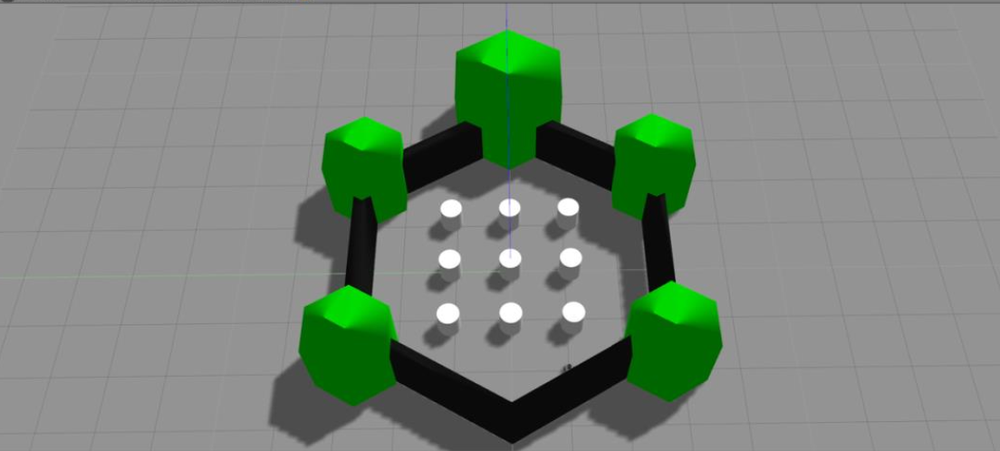
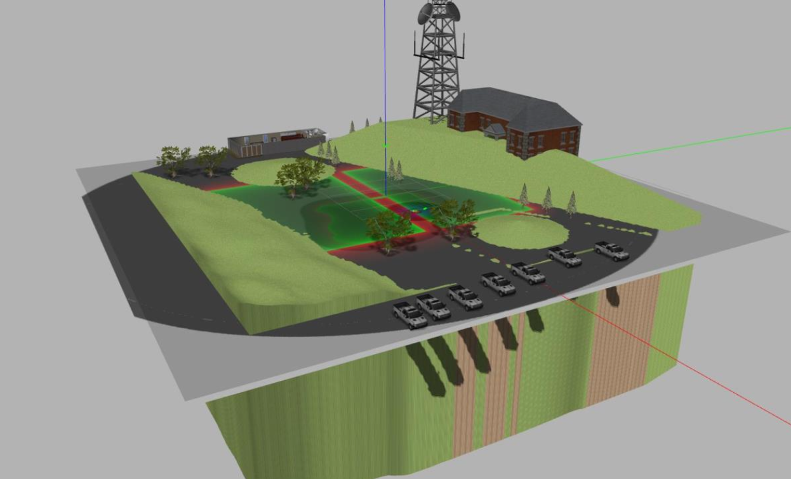
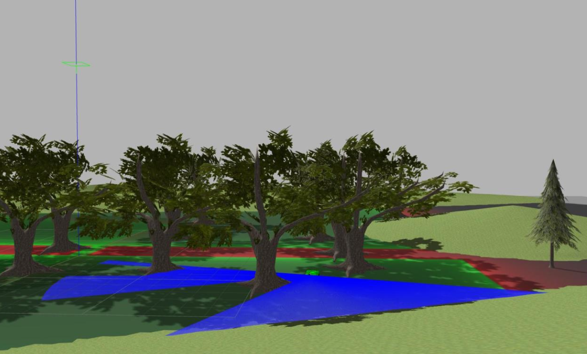

# HRP Lawnmower Obstacle Avoidance System

This project aims to develop a comprehensive obstacle avoidance system for the **Husqvarna 430x lawnmower**. Three control modes are implemented, providing varying degrees of user interaction and autonomy:

- **Teleoperation**: Full control of the lawnmower is managed by the user.
- **Semi-Autonomous**: A shared control mode allowing user intervention when necessary.
- **Fully Autonomous**: The lawnmower operates independently, relying on its decision-making capabilities.

The system includes algorithms for obstacle detection, direction adjustment, dynamic speed control, and advanced decision-making using fuzzy logic. A user interface has been designed to enable seamless switching between operation modes during runtime, enhancing the user experience.

This project delivers a robust, adaptable, and user-friendly obstacle avoidance system for the Husqvarna 430x lawnmower, offering a foundation for future applications in similar products.

This software is designed to run under Linux with Ubuntu 16.04 and ROS Kinetic.

## Installation Instructions

Follow these steps to install the software on your host computer:

### 1. Unpack the Software
- Extract the `htp_teleop.zip` file into the `src` directory of your Catkin workspace.

### 2. Install Dependencies
Use the following commands to install the required dependencies:

```bash
sudo apt-get install ros-kinetic-gazebo-ros-control
sudo apt-get install ros-kinetic-joint-state-controller
sudo apt-get install ros-kinetic-hector-gazebo-plugins
sudo apt-get install ros-kinetic-hector-gazebo
sudo apt-get install python-pygame
sudo pip3 install -U scikit-fuzzy
```

### 3. Build the ROS Workspace
Navigate to your Catkin workspace and build the project:

```bash
cd ~/catkin_ws
catkin_make
```

### 4. Set Up the Gazebo Model Path
Configure the Gazebo model path by running the following command:

```bash
export GAZEBO_MODEL_PATH=~/.gazebo/models:$GAZEBO_MODEL_PATH
```

---

## Running the Simulated Environment

### 1. Start the Simulation
Launch the Gazebo simulation with the following command:

```bash
roslaunch am_gazebo am_gazebo_hrp.launch gui:=true
```

### 2. Run Different Nodes
Depending on the mode, launch the corresponding nodes:

1. Source the ROS workspace:
   ```bash
   source ~/catkin_ws/devel/setup.bash
   ```

2. Run the appropriate node for each mode:
   - **Mode 0 and 2**:
     ```bash
     rosrun am_driver hrp_teleop_or_auto.py
     ```
   - **Mode 0 and 3**:
     ```bash
     rosrun am_driver teleop_or_slowdown.py
     ```
   - **Mode 5**:
     ```bash
     rosrun am_driver shared_control_slowdown.py
     ```
   - **Mode 1**:
     ```bash
     rosrun am_driver bumper_teleop.py
     ```
   - **Mode 0, 4, 6, 7**:
     ```bash
     rosrun am_driver fuzzy_logic.py
     ```

### 3. Launch the Interface
Navigate to the appropriate directory and run the interface:

```bash
cd /path/to/interface_directory
python interface.py
```

## Simulation Environment Examples

Below are some examples of the developed simulation environments:

<p align="center">
  
  
  
</p>

